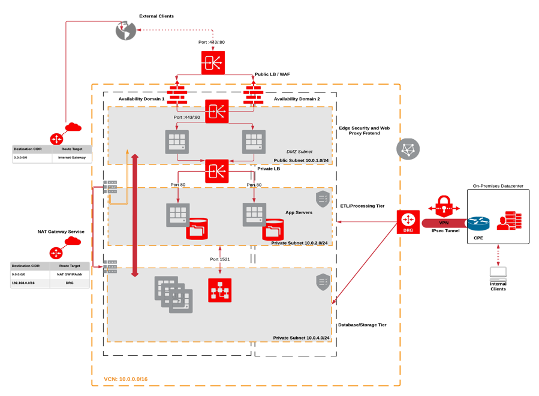
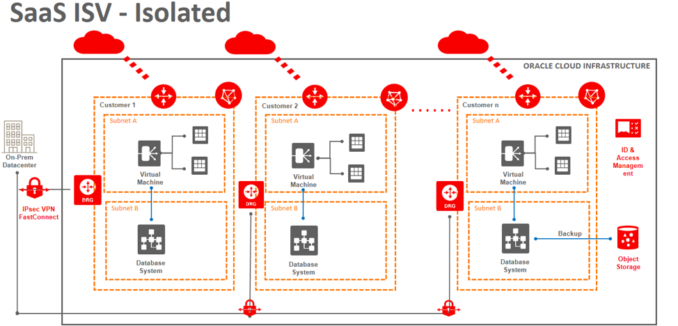
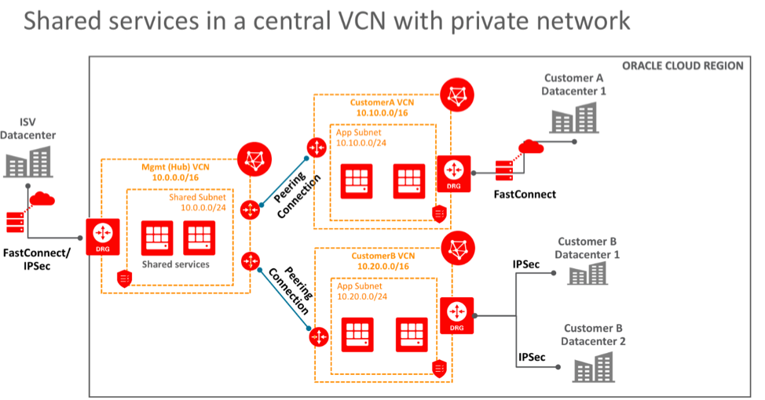

# Network Architectures

## Introduction
This segment of the framework provides a standard baseline for best practices around networking architecture. These three (for now) models will provide a great starting point for enterprise customers who are looking to prep their business for OCI.

## Objectives
- Deploy a N-Tier Webapp Architecture
- Deploy a SaaS Isolated Architecture
- Deploy a Saas Shared Architecture

## Step 1 - Example details
The examples can be found in `thunder->examples->network-architectures`

The definition of each resource can be inspected in the **terraform.tfvars** file in the `thunder->examples->network_architectures` directory.

Don't forget to populate the **provider.auto.tfvars** with the details of your tenancy as specified in the [Lab 3 - Prerequisites Step 5](../../../workshop/index.html?lab=lab-3-install-prepare-prerequisites).

Apart from the **provider.auto.tfvars**, there may be some other dependencies in the **terraform.tfvars** file that you will have to address.
All the dependencies from this section should have resources that already exist in OCI.

For this example, you are going to have dependencies to some external resources:
- compartments

In order to address those, you will need to change the values of the variables accordingly in the **terraform.tfvars** file.

Below, you will see the dependencies and what variables need to be changed.

#### Compartment Dependency
In order to be able to run the sample code, you will have to prepare a map variable (like in the **terraform.tfvars** file) called **compartment\_ids**, which will hold key/value pairs with the names and ids of the compartments that you want to use.
This variable will be external in order to offer multiple ways of linking them from a terraform perspective.

```
compartment_ids = {
  sandbox = "ocid1.compartment.oc1.."
}
```


## Step 2 - Deploy a N-Tier Webapp Architecture

This example can be found in `thunder->examples->network-architectures->n_tier_web_app`

Components within the legacy application or SOA pattern can be tiered in multiple ways. Starting with the 2-Tier Application, a customer may have a single server, or multiple servers handling requests of the application presentation, business, and persistence to that are connected to a stand-alone database.

Below you can observe what will be deployed:


If you want to create this architecture, please jump to `Step 5 - Running the code`.

## Step 3 - Deploy a SaaS Isolated Architecture

This example can be found in `thunder->examples->network-architectures->saas_isolated_app`
 Network isolation ensures that the applications and data are segregated from the other deployments in the tenancy.

Below you can observe what will be deployed:


If you want to create this architecture, please jump to `Step 5 - Running the code`.

## Step 4 - SaaS Shared Architecture

This example can be found in `thunder->examples->network-architectures->saas_shared_app`

This ensures that the applications and data are segregated from the other deployments in separate subnets with different security lists and access. This can be achieved using the peering functionality having the hub VCN peered to separate tenant subnets. This patterns generally mapped as a baseline for providing customer management and control (cmc2) across the network

Below you can observe what will be deployed:


If you want to create this architecture, please jump to `Step 5 - Running the code`.

## Step 5 - Running the code

In order to run the code, you will simply have to go to the directory containing the desired architecture you want to create (e.g **thunder/examples/network_architectures/saas\_isolated\_arch**) and do the following:

```
# Run init to get terraform modules
$ terraform init

# Create the infrastructure
$ terraform apply --var-file=path_to_provider.auto.tfvars_file

# If you are done with this infrastructure, take it down
$ terraform destroy --var-file=path_to_provider.auto.tfvars_file
```


## Results
By running the different examples from this lab, you will get 3 different network architectures up and running in OCI.
- N tier web app
- SaaS Isolated
- SaaS Shared
